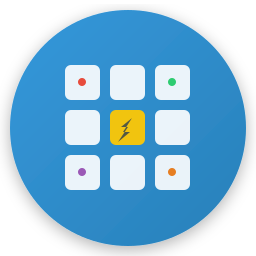
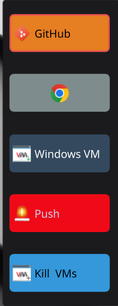
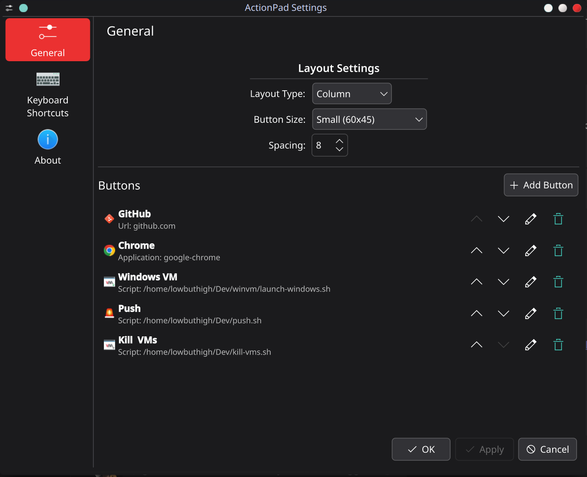
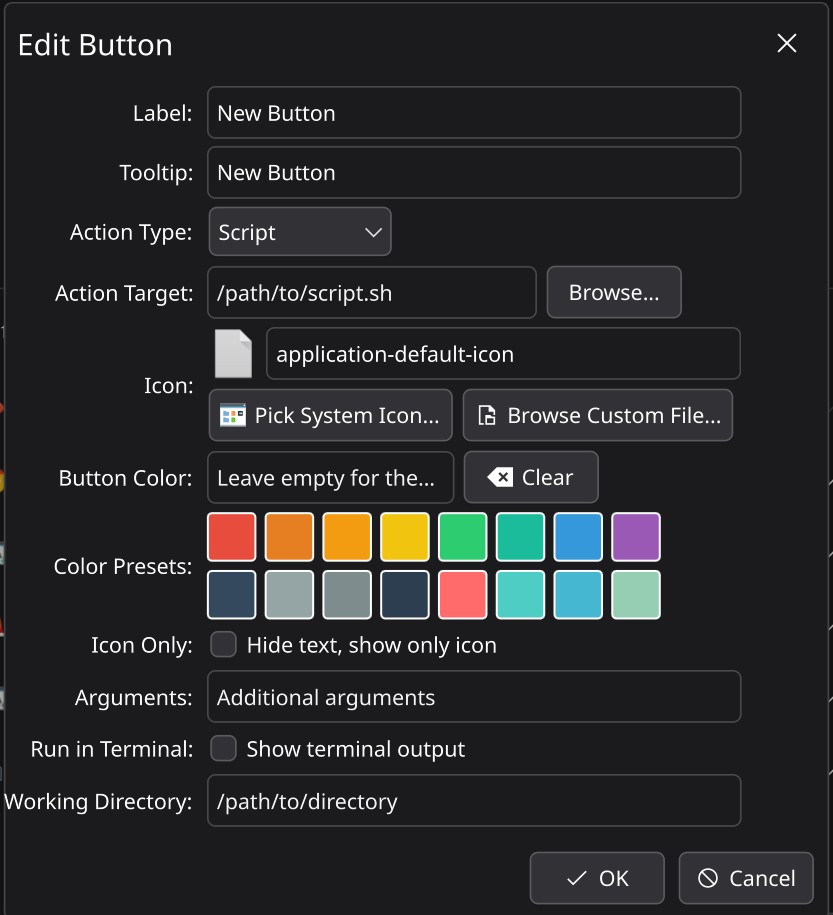

# ActionPad for KDE Plasma 6

<div align="center">



**Run scripts without .desktop files • Launch apps • Open websites**

A powerful KDE Plasma 6 widget with native C++ command execution

[](https://www.gnu.org/licenses/gpl-3.0)
[](https://kde.org/plasma-desktop/)
[](https://www.qt.io/)

[Features](#features) • [Installation](#installation) • [Usage](#usage) • [Documentation](#documentation) • [Contributing](#contributing)

[](https://github.com/OlaProeis/ActionPad)

</div>

---

## Overview

ActionPad is a highly customizable KDE Plasma 6 widget that puts your most-used scripts, applications, and websites at your fingertips. With a sleek design that follows your system theme, it provides instant access to your favorite actions with just one click.

**Unlike other launcher widgets**, ActionPad includes a **native C++ command executor** that lets you run shell scripts directly - **no .desktop files required**. This makes it perfect for developers and power users who want quick access to custom scripts without the hassle of creating and managing desktop entry files.

### Why ActionPad?

- ⚡ **No .desktop Files Needed** - Run scripts directly with our C++ executor (unique feature!)
- 🚀 **Lightning Fast** - Execute scripts, launch apps, and open websites instantly
- 🎨 **Fully Customizable** - Colors, icons, layouts, and sizes tailored to your needs
- 🖌️ **Theme Integration** - Seamlessly blends with your KDE Plasma theme
- 📱 **Flexible Layout** - Grid, row, or column layouts that adapt to any screen
- 🔧 **Powerful Actions** - Run scripts with arguments, custom working directories, and terminal support
- 🎯 **Icon-Only Mode** - Minimalist design with large, centered icons
- 🌈 **16 Color Presets** - Quick color selection with visual feedback

---

## Features

### 🎯 Core Functionality

- **Multiple Action Types**
  - Execute shell scripts and commands
  - Launch applications
  - Open URLs in your default browser

- **Advanced Script Execution**
  - Custom arguments support
  - Working directory configuration
  - Run in terminal option with output display
  - Full command execution via C++ plugin

### 🎨 Customization

- **Visual Customization**
  - Custom button labels and tooltips
  - System icon picker with 1000+ icons
  - Custom icon file support (PNG, SVG, JPG)
  - 16 color presets + manual color entry
  - Icon-only mode with scalable icons
  - Three button sizes (Small, Medium, Large)

- **Layout Options**
  - Grid layout with configurable columns
  - Horizontal row layout
  - Vertical column layout
  - Adjustable spacing
  - Dynamic sizing based on button count

### 🔧 Management

- **Button Management**
  - Add unlimited buttons
  - Edit any button property
  - Reorder with Move Up/Down
  - Delete buttons
  - Persistent configuration

- **User Experience**
  - Drag-and-drop friendly interface
  - Live icon preview in config
  - Enhanced tooltips with action details
  - Visual click feedback
  - Theme-aware contrast colors

---

## Screenshots

<div align="center">

### Widget in Action


### Configuration Dialog


### Add Button Interface


</div>

---

## Installation

### Prerequisites

- **KDE Plasma 6.0+**
- **Qt 6.0+**
- **CMake 3.16+**
- **C++ Compiler** (GCC or Clang)

### Required Packages

#### Fedora
```bash
sudo dnf install cmake extra-cmake-modules qt6-qtbase-devel \
                 kf6-kcoreaddons-devel kf6-ki18n-devel kf6-kconfigwidgets-devel \
                 kf6-kiconthemes-devel plasma-workspace-devel
```

#### Ubuntu/Debian
```bash
sudo apt install cmake extra-cmake-modules qt6-base-dev \
                 libkf6coreaddons-dev libkf6i18n-dev libkf6configwidgets-dev \
                 libkf6iconthemes-dev plasma-workspace-dev
```

#### Arch Linux
```bash
sudo pacman -S cmake extra-cmake-modules qt6-base \
               kf6-kcoreaddons kf6-ki18n kf6-kconfigwidgets \
               kf6-kiconthemes plasma-workspace
```

### Build from Source

1. **Clone the repository**
   ```bash
   git clone https://github.com/OlaProeis/ActionPad.git
   cd actionpad
   ```

2. **Build and install**
   ```bash
   ./build-and-install.sh
   ```

   Or manually:
   ```bash
   mkdir build
   cd build
   cmake -DCMAKE_INSTALL_PREFIX=/usr ..
   make -j$(nproc)
   sudo make install
   ```

3. **Restart Plasma Shell**
   ```bash
   killall plasmashell && plasmashell &
   ```

4. **Add the widget**
   - Right-click on your panel or desktop
   - Select "Add Widgets"
   - Search for "ActionPad"
   - Drag it to your desired location

---

## Usage

### Quick Start

1. **Add your first button**
   - Right-click the widget
   - Select "Configure ActionPad"
   - Click "Add New Button"

2. **Configure the button**
   - **Label**: Enter button text (e.g., "Terminal")
   - **Tooltip**: Enter hover text
   - **Action Type**: Choose Script, Application, or URL
   - **Action Target**: Enter the path/command/URL
   - **Icon**: Pick from system icons or upload custom image
   - **Color**: Choose from presets or enter custom color

3. **Click "OK"** to save

### Action Types

#### 🔧 Script
Execute shell scripts or commands:
```bash
# Example: Open system monitor
/usr/bin/konsole -e htop

# Example: Run custom script
/home/user/scripts/backup.sh

# With arguments
/home/user/scripts/deploy.sh --production
```

**Options:**
- Arguments field for passing parameters
- Working directory for script execution
- Run in terminal checkbox for interactive scripts

#### 🚀 Application
Launch applications by name or .desktop file:
```bash
firefox
kate
/usr/share/applications/steam.desktop
```

#### 🌐 URL
Open websites in default browser:
```
https://github.com
tog.no
localhost:3000
```
*Protocol (https://) is added automatically if not specified*

### Layout Configuration

1. **Layout Type**
   - **Grid**: Buttons arranged in rows and columns
   - **Row**: All buttons in a horizontal line
   - **Column**: All buttons in a vertical line

2. **Button Size**
   - **Small**: Compact buttons
   - **Medium**: Standard size (default)
   - **Large**: Prominent buttons

3. **Spacing**: Adjust pixel spacing between buttons

4. **Grid Columns**: Set number of columns (Grid layout only)

### Tips & Tricks

- **Icon-Only Mode**: Enable for a minimalist look with large, centered icons
- **Color Contrast**: Widget automatically adjusts text color for readability
- **Keyboard Navigation**: Tab through buttons, Enter to activate
- **Panel vs Desktop**: Widget adapts layout automatically
- **Theme Integration**: Widget colors update when you change KDE themes

---

## Documentation

Comprehensive documentation is available in the [`docs/`](docs/) directory:

- **[User Guide](docs/USER_GUIDE.md)** - Detailed usage instructions
- **[Configuration](docs/CONFIGURATION.md)** - All configuration options explained
- **[Development](docs/DEVELOPMENT.md)** - Build and development guide
- **[API Reference](docs/API.md)** - QML API and C++ plugin documentation
- **[Troubleshooting](docs/TROUBLESHOOTING.md)** - Common issues and solutions
- **[Examples](docs/EXAMPLES.md)** - Real-world button configurations

---

## Contributing

We welcome contributions! Please see [CONTRIBUTING.md](CONTRIBUTING.md) for details.

### Development Setup

```bash
git clone https://github.com/yourusername/shortcutwidget.git
cd shortcutwidget
mkdir build && cd build
cmake ..
make
```

See [DEVELOPMENT.md](docs/DEVELOPMENT.md) for detailed development instructions.

---

## Changelog

See [CHANGELOG.md](CHANGELOG.md) for version history and release notes.

---

## License

This project is licensed under the GNU General Public License v3.0 - see the [LICENSE](LICENSE) file for details.

```
Copyright (C) 2025 Your Name

This program is free software: you can redistribute it and/or modify
it under the terms of the GNU General Public License as published by
the Free Software Foundation, either version 3 of the License, or
(at your option) any later version.
```

---

## Acknowledgments

- KDE Community for the amazing Plasma desktop
- Qt Project for the excellent framework
- All contributors and users

---

## Support

- 🐛 **Bug Reports**: [GitHub Issues](https://github.com/OlaProeis/ActionPad/issues)
- 💡 **Feature Requests**: [GitHub Discussions](https://github.com/OlaProeis/ActionPad/discussions)
- 📧 **Contact**: Create an issue on GitHub

---

<div align="center">

**[⬆ back to top](#shortcut-widget-for-kde-plasma-6)**

Made with ❤️ for the KDE community

</div>
